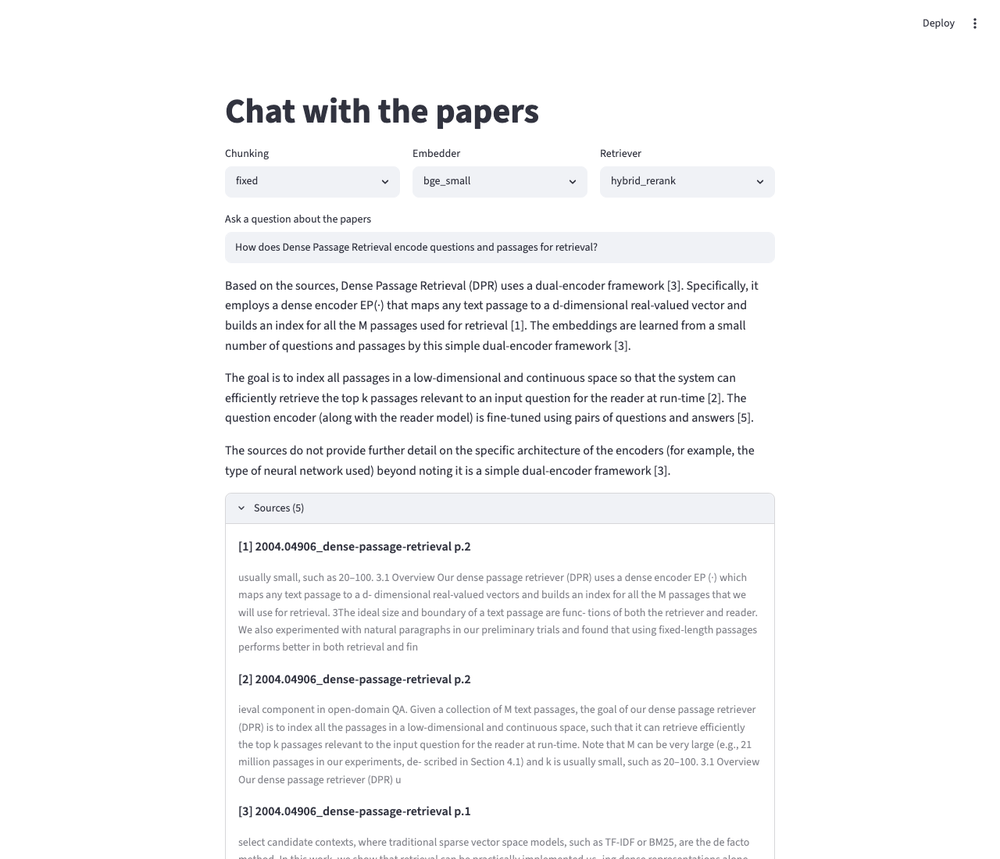

# RAG over research papers — with an evaluation harness that's the actual project

A "chat with a document set" system over 15 retrieval/RAG/embeddings papers from arXiv,
with grounded answers and **exact page/section citations**. The chatbot is table stakes —
the point of this repo is the **evaluation harness**: a systematic, reproducible comparison
of retrieval strategies and chunk×embedding configs, scored with DeepEval plus a **custom
citation-faithfulness metric** that measures the standout feature directly.



<!-- CI badge — set OWNER/REPO after pushing to GitHub:
[](https://github.com/OWNER/REPO/actions/workflows/ci.yml) -->

## Results

All numbers below were produced by `python eval/run_matrix.py` against the live API
(judge + generation: Claude `claude-opus-4-8`; embedders/reranker local). Re-run to
regenerate `results/*.md` and `results/*.csv`.

### 1. Retrieval ladder — the baseline → senior lift (NDCG/Recall/MRR, 50 questions)

| retriever | NDCG@5 | Recall@5 | MRR |
|---|---|---|---|
| dense (naive single-vector) | 0.333 | 0.44 | 0.299 |
| + BM25 hybrid (reciprocal-rank fusion) | 0.433 | 0.58 | 0.384 |
| + cross-encoder rerank | **0.618** | **0.76** | **0.570** |

**Naive dense → hybrid+rerank: NDCG@5 0.33 → 0.62 (+86%), Recall@5 0.44 → 0.76.** The
absolutes are deliberately modest, not pinned near 1.0: the gold questions are paraphrased
so they don't lexically echo their source passage, so dense-embedding match alone only
reaches 0.33 — BM25 recovers lexical signal and the cross-encoder recovers the rest. With
single-positive ground truth these are **conservative lower bounds** (see Limitations).

### 2. Generation matrix — 2 chunking × 2 embedding (at hybrid+rerank, 20 questions)

| config (chunk × embed) | faithfulness | answer relevance | context precision | context recall | **citation precision** | **citation recall** |
|---|---|---|---|---|---|---|
| fixed × bge-small | 1.0 | 0.892 | 0.754 | 0.85 | 1.0 | 0.983 |
| fixed × e5-large | 0.99 | 0.975 | 0.788 | 0.85 | 1.0 | 1.0 |
| semantic × bge-small | 1.0 | 0.98 | 0.807 | 0.733 | 1.0 | 0.988 |
| semantic × e5-large | 1.0 | 0.942 | **0.846** | 0.85 | 1.0 | 0.975 |

The four DeepEval metrics use Claude as the judge; the last two columns are the custom
citation metric (below).

## The custom citation-faithfulness metric (the centerpiece)

`eval/citation_metric.py` scores the feature that distinguishes this from a generic
chat-with-PDF: do the inline `[n]` citations actually hold up? It's framed in
attribution-eval (ALCE) terms and is **gold-independent** — it audits the answer against
its *cited* sources only, never touching the (synthetic) gold set:

- **citation precision** — of the claims that carry a `[n]`, the fraction whose cited
  source actually states the claim. *(When you cite, are you right?)*
- **citation recall** — of all factual claims, the fraction that carry ≥1 citation.
  *(Do you cite everything you assert?)*

Honest refusals ("the sources don't cover this") have no claims to cite and are **excluded**,
not scored 0. Behavior is verified by construction (`tests/test_citation_metric.py`): a
correctly-cited answer scores 1.0/1.0; an answer that cites the wrong source and leaves a
claim uncited scores **precision 0.0 / recall 0.5**.

## What I learned

- **The citation feature works, and it's measurable.** Citation precision is 1.0 across
  every config and recall ~0.98–1.0 — Claude, given a grounded prompt and numbered sources,
  essentially never miscites and rarely leaves a claim uncited. Because this metric is
  gold-independent, it's the result I'd trust and lead with.
- **The bottleneck is retrieval, not generation.** Faithfulness and citation precision
  both saturate near 1.0 regardless of chunk/embed config — a strong generator stays
  grounded no matter what you feed it. The configs only separate on **context precision**
  (0.754 → 0.846), where semantic chunking + e5-large wins, at ~3× the embedding cost of
  bge-small. semantic×bge-small is the one cell that trades recall (0.733) for precision.
- **Hybrid + rerank is worth it.** The +86% NDCG lift is real and monotonic; the
  cross-encoder is the single biggest jump (0.43 → 0.62).

## Limitations (named, not hidden)

- **The gold set is synthetic and not hand-verified.** Questions + answers are generated by
  Claude from each chunk (`eval/gold.py`), then lightly filtered — not human-reviewed.
- **It is structurally circular for *retrieval*.** Each question is generated from the chunk
  that is then its only ground truth, so that chunk tends to rank highly under every
  retriever. De-lexicalizing the questions cuts keyword leakage but not the structural
  coupling — which is exactly why the headline signal is the gold-independent citation metric.
- **Single-positive ground truth deflates Recall@k** whenever other chunks are also relevant,
  so the retrieval numbers are conservative.
- The generation matrix is capped at `MATRIX_GEN_SAMPLE` questions (default 20) for API cost;
  raise/unset it for the full set.

## Architecture

```
rag/
  ingest.py      # PDF -> page/section-aware blocks (pymupdf)
  chunk.py       # fixed-size | semantic (sentence-greedy, size cap, no LLM)
  embed.py       # bge-small-en-v1.5 | e5-large-v2 (sentence-transformers)
  store.py       # Chroma collection per (chunk, embed) config, cosine
  retrieve.py    # dense | BM25 | hybrid (RRF) | hybrid + cross-encoder rerank
  generate.py    # grounded Claude answer with inline [n] page/section citations
  pipeline.py    # RAGPipeline: build()/load()/retrieve()/ask()
eval/
  retrieval_metrics.py  # NDCG@k, Recall@k, MRR (pure)
  gold.py               # synthesize + load gold set (JSONL)
  metrics.py            # DeepEval faithfulness/relevance/ctx precision+recall
  citation_metric.py    # custom ALCE-style citation precision/recall
  run_matrix.py         # runs both tables -> results/*.{md,csv}
  test_rag.py           # pytest quality gate
app/streamlit_app.py    # demo: config selector + cited answer + source panel
```

## Run it

```bash
# 1. corpus + key
#    drop ~10-20 arXiv PDFs into data/papers/
cp .env.example .env          # then add ANTHROPIC_API_KEY

# 2. install (editable; puts config, rag, eval on the path)
python3 -m venv .venv && source .venv/bin/activate
pip install -e ".[dev]"

# 3. build the 4 indexes, synthesize + hand-check the gold set, run the matrix
python scripts/build_index.py
python scripts/synthesize_gold.py      # then review data/gold.jsonl
python eval/run_matrix.py              # writes results/*.{md,csv}

# 4. tests + demo
pytest                                  # full suite (needs key + models)
streamlit run app/streamlit_app.py
python scripts/capture_screenshot.py    # regenerate docs/screenshot.png
```

CI (`.github/workflows/ci.yml`) runs the offline tests only — `test_config`, `test_chunk`,
`test_retrieval_metrics`, `test_run_matrix`, `test_citation_metric` — which need no API key
and no model downloads. The model/API tests are excluded by design.

## Deploy (Hugging Face Spaces)

Create a Streamlit Space, set `ANTHROPIC_API_KEY` as a Space secret, point the app file at
`app/streamlit_app.py`, and commit `data/papers/*.pdf` + `data/gold.jsonl` so the Space can
build the index on boot. Spaces is preferred over Streamlit Community Cloud because the
local embedders (e5-large) need the extra RAM.

## License

MIT — see [LICENSE](LICENSE).
